# SubNotes

A lightweight macOS companion that sits on top of the system Calendar. It does
not duplicate your calendar — Google events already sync into Calendar.app via
Internet Accounts. SubNotes adds the things the stock app lacks:

- **Desktop widget** — your next events at a glance.
- **Menu-bar ticker** — reminders that appear shortly before an event (RunCat-style).
- **Interactive overlays** — customizable, skinnable reminder windows
  (from a simple card to a flying-plane banner).

Menu-bar only (no Dock icon), built with SwiftUI + AppKit, reading the system
calendars through EventKit. Targets recent macOS (Liquid Glass).

> Status: early development. See [PLAN.md](PLAN.md) for the full roadmap.

## Roadmap to release

Schematic path from spike to the first public build. Solid = shipped/in progress
up to release; dotted = post-release. Keep this diagram in sync as phases land
(see the workflow rules in [PLAN.md](PLAN.md)).

```mermaid
flowchart LR
    P0["Phase 0 · Spike<br/>✅"] --> P1["Phase 1 · CalendarCore<br/>✅"]
    P1 --> P2["Phase 2 · Popover list<br/>✅"]
    P2 --> P3["Phase 3 · Menu-bar ticker<br/>✅"]
    P3 --> P4["Phase 4 · Overlays + skin engine<br/>✅"]
    P4 --> P5["Phase 5 · Settings · login item · .dmg + CI<br/>🚧"]
    P5 --> REL(["🚀 Release<br/>unsigned .dmg via GitHub"])
    REL -.-> P6["Phase 6 · Color-keyed rules"]
    P6 -.-> GA["Google Calendar API<br/>per-event color"]
```



| Phase | Scope | Status |
|---|---|---|
| 0 | Spike — menu-bar app reads EventKit (widget dropped) | ✅ done |
| 1 | CalendarCore — model, access, live refresh, video links | ✅ done |
| 2 | Popover list — grouped by day, color key, deep-link | ✅ done |
| 3 | Menu-bar ticker — smart appearance | ✅ done |
| 4 | Overlays — transparent window, skin engine, button layer | ✅ done |
| 5 | Settings, login item, `.dmg` packaging + CI → **release** | 🚧 next |

Phase 6 (color-keyed customization) and the read-only Google Calendar API step
land **after** the first release.

## Why this project

> "I don't give a damn about learning Swift — I just want a utility that's
> convenient for me. With this project I want to find out for myself how
> autonomous neural networks really are at this kind of thing right now."
>
> — the author

> «Мне нахрен не нужно учить Swift, я просто хочу удобную мне утилиту. Этим
> проектом я хочу понять для себя, насколько самостоятельны нейросети в
> подобном сейчас.»
>
> — автор

## Building

Requires Xcode 26+ and [XcodeGen](https://github.com/yonaskolb/XcodeGen).

```sh
xcodegen generate
open SubNotes.xcodeproj
```

## License

[MIT](LICENSE)
